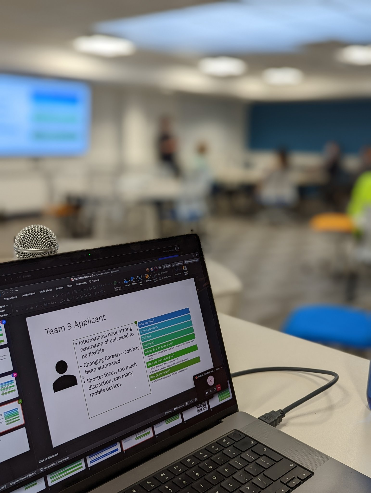
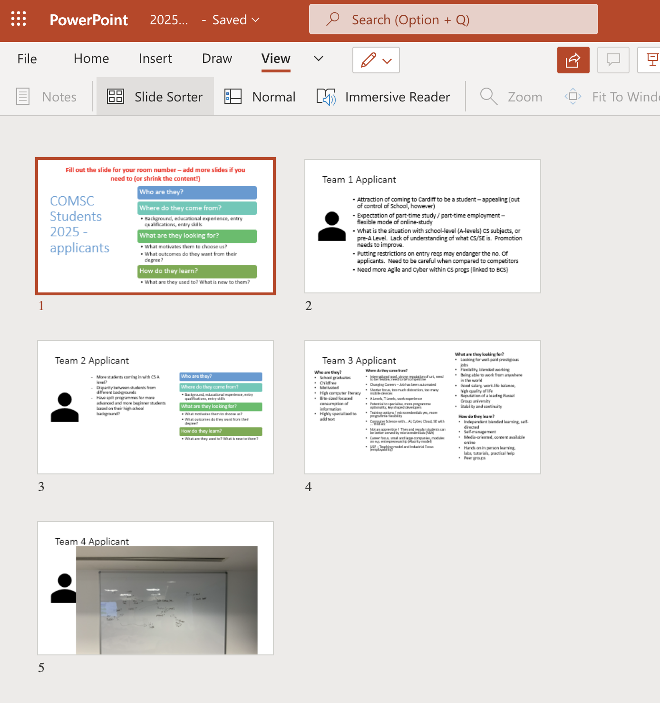

__as I've [mentioned previously](https://www.martinjc.com/blog/posts/2022-03-08-programme-review/), we're running some workshops to review some of our programmes with a view to changes needed in the future. As part of this process we held our first hybrid teaching workshop this week, and I thought I'd write about the general process before I write about the outputs__

> "Our intention is to run this workshop in a hybrid fashion - with people in a location tbc ... and also online. We'll see how much of a car crash that is ..."

That's from the invite to our latest teaching workshop, which we ran yesterday with several participants physically present in one of our seminar rooms, and more participants joining in from a Teams meeting online. It was our first hybrid teaching workshop with staff (though not our first hybrid teaching session by some distance[^ref-hybrid]). I was a bit concerned whether anyone would actually turn up in person, especially as the weather was a typically rainy Cardiff day, but in the end we had a bunch of 'real' people in the room, and a bunch of equally 'real' but less physically present people online. It worked well, and I think it's worth getting some thoughts down about the process. 

## The structure

The first thing that helped was that the session was structured very much as an active session to facilitate reflection in and gather input from the participants, but with a slight cheat in that the amount of 'whole group' discussion was artificially limited. The basic structure was:

1. A short introduction from me to set the context of the workshop, lay out the plan for the session, and how it fits in with the overall review we're doing. The aim was for this to take 5 minutes. It took 15.
2. A first activity looking at a potential University applicant in 3-4 years time
3. A second activity looking at a potential University graduate in 8-9 years time
4. A third activity asking 'what would we do if there were no rules?'

Each activity was run as a group discussion session, with groups of 6-8 people talking about the topic in question for 15-20 minutes, with a feedback session after each discussion. In order to capture the discussions the group present in the room had access to flipcharts and pens, but being a bunch of academics naturally gravitated to the whiteboard. Online the groups were in breakout rooms within the Teams meeting, and they all had access to a shared powerpoint file, with an individual slide for each room on which they could capture their discussion points.

## The setup

The online meeting was in Teams and my laptop was plugged into the room's AV system so that the teams meeting itself was displayed on the screens in the room. I kept the directional microphone on the lectern pointed at the laptop so the participants in the room could definitely hear the people online. A few of the 'physical' participants had their laptops with them and were also signed into Teams, so whenever they wanted to contribute to the discussion they could unmute and speak towards a device near them rather than relying on my laptop mic in the centre of the room. I had to remember to mute the audio on my laptop during those moments to avoid horrible feedback. 

## The reflection

Did it work? Yes. Participants both online and in the room were able to participate in the session. Some of the good things that worked well:

* Shared .pptx files were great. This is a good technique I've used before, and that has been written about in a few places online. Having each group working on a different slide makes it very easy to see which groups are getting on with the task without needing to hop in and out of the breakout rooms. I added an extra slide in each deck for the team in the room, then when we were wrapping up the discussion I could take a photo of the 'physical' team's whiteboard, and drop that into the shared powerpoint so the people online could see the full contribution from the room.
* The feedback for each activity was also made simple by using the shared powerpoint - we just shared that within the team and moved through the slides, asking each room to highlight anything on their slide that they thought was pertinent.
* By monitoring the online text chat the people in the room were also able to participate in the side-channel discussion that often happens in online meetings alongside the main thread of audio conversation.

Some caveats on this though:

* It was a smallish workshop. We had 7 people in the room, and another 24 online. I *think* it's scalable. Certainly the notion of sharing the file between all groups would work, but with more groups in the room there'd need to be a bit more time for adding the 'in room' content to the online presentation. 
* I assume (thought not with any evidence) that there's going to be an upper limit somewhere on the number of people that can be editing a powerpoint presentation at the same time before something craps out on you.
* You do need to be comfortable with multi-tasking for this. During 'whole group' sessions you're trying to watch the text chat online for pertinent comments, look out for people online wanting to contribute and also keeping an eye on the room. During the breakout activity you need to keep an eye on each room's chat, the activity in the shared presentation *and* the conversation going on in the room. 
* As I said, the amount of 'whole group' discussion was limited. This was partially down to time, as there was a lot to do in a short session. It was also partly as there is a further asynchronous feedback/discussion space available online after the workshop. It was also because I think that's probably one activity that may not work so well in a hybrid session such as this, so minimising the amount of discussion between groups makes sense. 

Really though, the only thing I'd change in future is try to have more of a balance of in-room vs. online participants, so perhaps at the next one we'll try and have cake to entice a few more out of the digital space. Also we'll not clash it with an event in the main school building that's booked all the good seminar rooms, so we can hold it in the same building that people actually work in. 

## The feedback

Other people also seemed to think it worked:

## The outro

Some thoughts there on the Hybrid workshop we ran. I thought it would be useful for people to hear how it went, before we dig into what we actually got out of it.

[^ref-hybrid]: I'm not here to rehash any of the arguments about hybrid teaching, or hyflex, or whatever the hell people are calling it now. My experience of hybrid teaching has been good to date, and I've had numerous students thank me for running hybrid sessions when they've not been able to make it in in person. However, as my Head of School noted today, it's probably not for everyone and it likely suits the sort of educator who thrives on a bit of chaos in their teaching sessions, and it [turns out that's me](https://twitter.com/martinjc/status/1490640853559394305)

